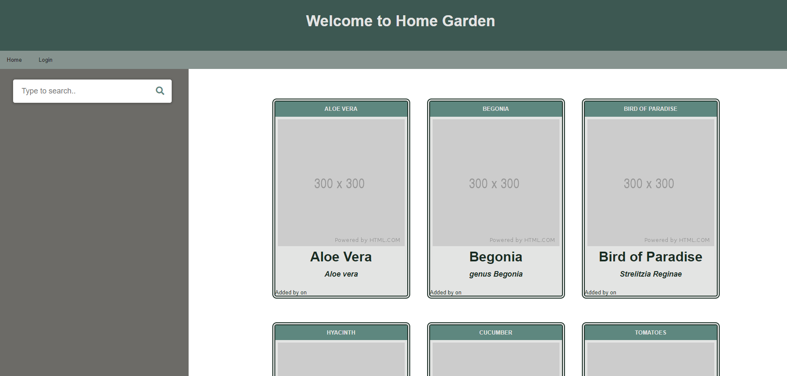
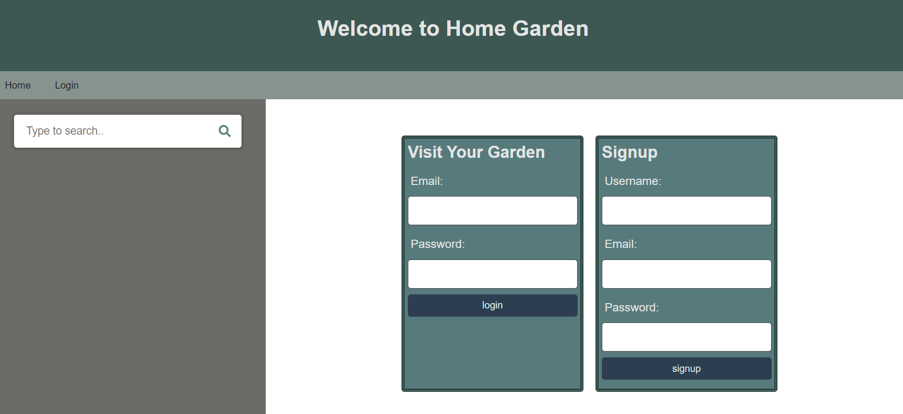
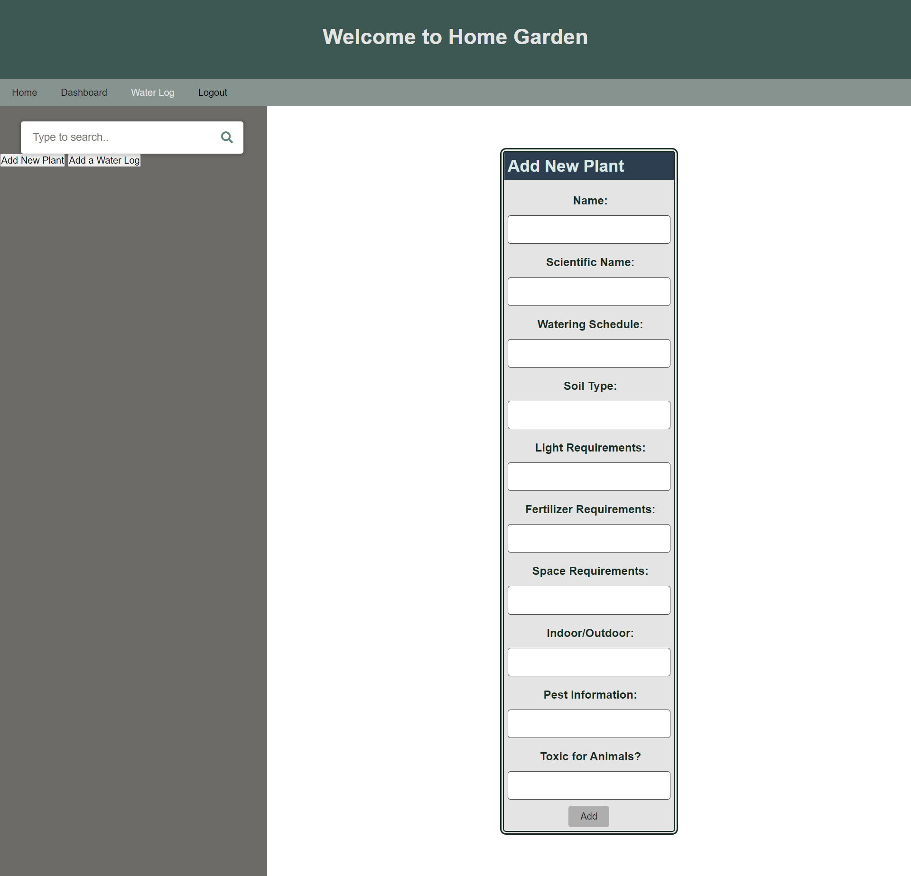
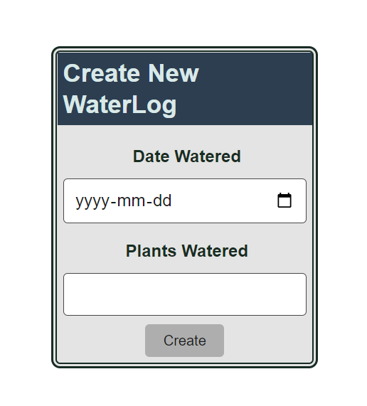

# Home-Garden-Manager

Team 3 - Sierra Davis, Rosemarie Halim, Phil McGarty, Jenna Saikaly

---

## Description

A site that allows plant enthusiasts to easily find care instructions for plants they own, as well as contribute to the plant database, and create logs to track their plant watering activity.

Created with JavaScript, Node.js, MySQL, Handlebars, CSS, with Sequelize, Express.js, Express-Session, and bcrypt packages.

## Table of Contents
* [Installation](#installation)
* [Usage](#usage)
* [Tests](#tests)
* [Links](#links)

---
## Installation

**To create the database**

A .env file will need to be created at the root of the project, with the following code, including the user's password, and a string for the session secret:

*DB_NAME='garden_db'*

*DB_USER='root'*

*DB_PW=''*

*SESSION_SECRET=''*

Type the following at the root directory in MySQL prompt: 

*"source db/schema.sql"*

To seed the database, navigate to the root directory in  terminal window, and type: 

*"npm run seed"*

**To start the server**

Install all necessary packages, by typing:

*"npm i"*

To start the server, type the following in a terminal window: 

*"npm start"*

---
## Usage

On loading, the user is presented with a homepage displaying cards with all the plants in the database. The user can browse through these by scrolling the page, or they can use the searchbar on the left to look up a particular plant. When the user clicks on a plant card, it opens up further information about the plants.

The user can login, which allows them access to add a plant of their own to the database. When the user logs in, they are presented with a dashboard containing all the plants that they have created in the database, and can edit the plant information to update/fill in missing information, or delete plants entirely. A user can only update/delete plants which they themselves have added.

If logged in the user also has access to the watering log feature. This allows a user to easily track which plants they have watered and when.

This product is currently a MVP, and in future will include photos of each plant, more integration between the plant database and the watering log, and an ability for users to add plants they own to their profile.

---
## Tests

Home Garden Manager Homepage

Login and sign-up prompts

Input fields for adding a new plant

Add new watering log

---
## Links

[Home Garden Manager Repo on GitHub](https://github.com/SierraDavis2000/Home-Garden-Manager)

[Home Garden Manager Deployed on Heroku](https://warm-harbor-34559.herokuapp.com/)
